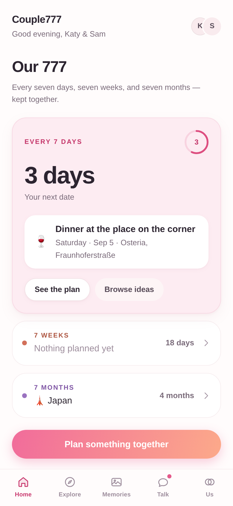

# Couple777

A private space for two, built around the **777 Relationship Rule**:

> Every **7 days** a date · every **7 weeks** a mini adventure · every **7 months** something bigger.

Not another calendar. A rhythm two people keep together, and a record of what
they made while keeping it.



## Running it

```bash
npm install
npm run dev      # http://localhost:5173
npm run build    # typecheck + production build
```

Mobile-first: open it on a phone, or narrow the browser. On a wide screen it
renders inside a centred device frame.

## What's here

All nine of the first-pass screens, wired into one loop:

| | |
|---|---|
| **Onboarding** | 5 steps — the rule, the two of you, the invite code, what stays private |
| **Home** | The three 777 countdowns, today's prompt, inspiration, recent memories |
| **Explore** | Date generator (6 filters + Surprise Me), mini adventures, big-trip wishlist |
| **Plan a date** | One editor for all three tiers, with a surprise toggle |
| **Plan detail** | Countdown, details, "We did this", and a planning space for big trips |
| **Memories** | Month-grouped timeline with a date gutter and connecting thread |
| **Memory detail** | Gallery, a shared line, each partner's own words, a private note |
| **Memory capture** | Offered automatically the moment a plan is completed |
| **Relationship Room** | 12 guided conversations: answer privately → reveal → agree one thing |
| **Daily question** | Sealed until you have both answered |
| **Notes** | Send now, send later, or keep private |
| **Us** | The relationship profile, presented emotionally rather than as a scoreboard |

## The loop

```
prompt → connect → plan → experience → capture → look forward
```

Every screen has an exit into the next stage. Finishing a Room conversation
offers to put something in the diary; revealing a daily answer offers to turn it
into a plan; completing a plan opens memory capture; capturing resets the
countdown. See [docs/PRODUCT.md](docs/PRODUCT.md) for the full architecture,
data model, and design system.

## Privacy

The split is enforced in the data model, not just hidden in the UI.

- **Shared** — plans, trips, memories, finished conversations.
- **Yours only** — private notes, and the private line on any memory.
- **Hidden until ready** — surprise plans, and wishlist saves until they match.
- **Sealed** — daily and Room answers, until you have both written one.

A partner's surprise renders as "A surprise, from them" and nothing more. A
mutual wishlist save is never named anywhere until the reveal has been shown.

## Stack

React 19 · TypeScript · Vite · react-router · CSS Modules over a design-token
layer. State is a reducer in context, persisted to `localStorage` — no backend,
by design. Sample data is generated relative to today, so the prototype never
goes stale.

Type is San Francisco on Apple platforms and Inter everywhere else. The palette
is soft blush and warm neutrals with a single rose accent, and every primary
action carries the pink → peach gradient. Light only, by design.

```
src/
  components/ui/       design-system primitives
  components/layout/   AppShell, TabBar, Screen
  features/            RitualCard, DailyCard, MemoryCard, IdeaCard, …
  screens/             one file per screen + its CSS module
  data/                ideas, adventures, destinations, prompts, topics, seed
  lib/                 types, dates & the 777 rhythm, selectors, generator
  styles/              tokens.css, global.css
```

## Prototype notes

Two things stand in for infrastructure a real build would have:

- **Photos** are seeded placeholders from `picsum.photos`, and memory capture
  offers a mock camera roll rather than a file picker. Every image falls back to
  a warm gradient if it fails to load.
- **Both partners share one device.** Us → Settings switches who is holding the
  phone, so you can see both sides of every private surface. The Relationship
  Room makes this explicit with a hand-over step; on two devices that step
  becomes a "waiting for them" state and nothing else changes.
